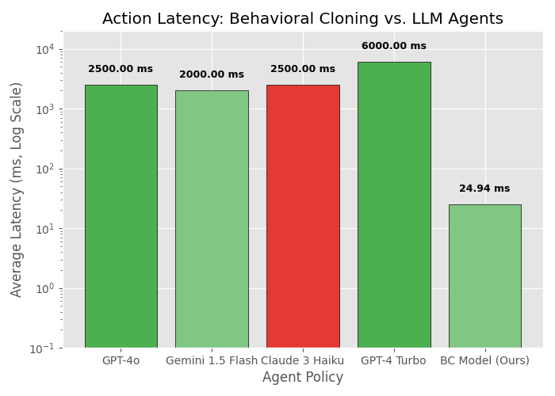

## Overview

This project implements **Behavioral Cloning** to train a CNN agent to play Atari Pong by learning from expert gameplay demonstrations. The model achieves competitive performance by imitating a pre-trained expert agent through supervised learning.

**Link to Processed Data**: [CSE5819 Processed Dataset](https://uconn-my.sharepoint.com/:f:/g/personal/peter_pettino_uconn_edu/IgDHgXW6CUXZRJXRJ33Dr7yxAeFN-zEN98IsWNgCvrW0ERs?e=dIc0p5)

## Results

### Performance Metrics

| Metric                 | Value    |
| ---------------------- | -------- |
| **Average Reward**     | -9.69    |
| **Standard Deviation** | 8.84     |
| **Action Latency**     | 24.94 ms |
| **Test Episodes**      | 100      |

### Action Distribution

| Action    | Percentage |
| --------- | ---------- |
| DOWN      | 30.94%     |
| LEFTFIRE  | 23.59%     |
| NOOP      | 19.82%     |
| UP        | 9.26%      |
| FIRE      | 8.41%      |
| RIGHTFIRE | 7.95%      |

### Visualizations

<div align="center">




</div>

---

## Installation

### Prerequisites

- Python 3.10 or higher
- pip package manager
- (Optional) CUDA-capable GPU for faster training

### Quick Start

```bash
# Clone the repository
git clone https://github.com/peter-pettino/Pong-Behavioral-Cloning
cd Pong-Behavioral-Cloning

# Create virtual environment (recommended)
python -m venv .venv
source .venv/bin/activate  # On Windows: .venv\Scripts\activate

# Install dependencies
pip install -r requirements.txt
```

### Required Packages

- `tensorflow>=2.15.0` - Deep learning framework
- `gymnasium[atari]` - Atari game environments
- `ale-py` - Arcade Learning Environment
- `opencv-python` - Image processing
- `numpy` - Numerical operations
- `pandas` - Data analysis
- `matplotlib` - Visualization
- `scikit-learn` - ML utilities

---

## Dataset

### Source

**Expert Gameplay Dataset**: [University of Michigan Deep Blue Repository](https://deepblue.lib.umich.edu/data/concern/data_sets/gq67jr854)

### Data Processing

```bash
# Process raw episodes into training dataset
python process_data.py

# Verify processed data
python verify_data.py
```

**Output**: `data/processed/pong_dataset.npz`

- Training samples: ~40,000 frames
- Test samples: ~10,000 frames
- Image preprocessing: 84×84 grayscale, normalized

---

## Usage

### 1. Train the Model

#### Local Training

```bash
# Quick smoke test (3 epochs, 1000 samples)
python train.py --smoke-test --epochs 3

# Full training (20 epochs)
python train.py --epochs 20 --batch-size 64 --lr 1e-4
```

#### Google Colab Training (Recommended)

1. Upload `pong_colab_training.ipynb` to [Google Colab](https://colab.research.google.com)
2. Upload `pong_dataset.npz` to Google Drive
3. Update the `DATA_PATH` in the notebook
4. Run all cells
5. Download trained weights (`best_model.weights.h5`)

### 2. Evaluate the Agent

```bash
# Play 100 episodes and generate performance report
python play_pong.py
```

**Outputs**:

- Console performance metrics
- `best_agent_report.csv` - Summary statistics
- `best_agent_data.csv` - Per-episode results

### 3. Generate Visualizations

```bash
# Create benchmark comparison charts
python generate_benchmark_visualizations.py
```

**Generated Charts**:

- `V1_Performance_Comparison.png` - Reward distributions
- `V2_Latency_Comparison.png` - Inference speed
- `V3_Action_Distribution.png` - Action frequency
- `V4_Score_Distribution_Histogram.png` - Score histogram

---

## Training

### Training Parameters

| Parameter        | Value                            |
| ---------------- | -------------------------------- |
| Batch Size       | 64                               |
| Epochs           | 20-30                            |
| Learning Rate    | 1e-4                             |
| Optimizer        | Adam                             |
| Loss Function    | Sparse Categorical Cross-Entropy |
| Validation Split | 20%                              |

## Performance Analysis

### Benchmark Results (100 Episodes)

The agent was evaluated over 100 episodes with a maximum of 1,000 steps per episode to ensure statistical significance:

#### Score Distribution

- **Mean Reward**: -9.69
- **Median Reward**: -11.0
- **Best Episode**: +3.0
- **Worst Episode**: -21.0
- **Std Deviation**: 8.84
